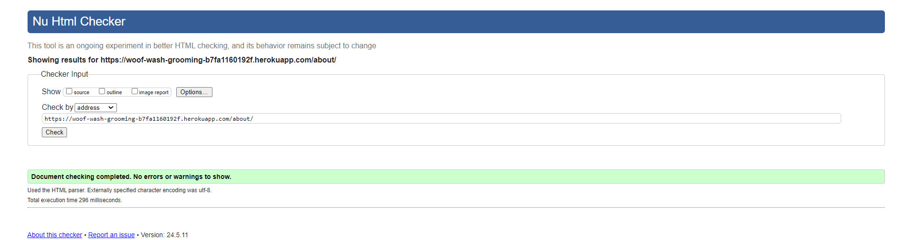
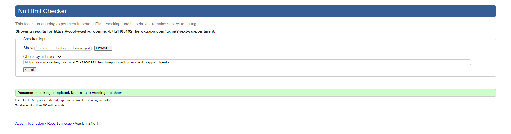
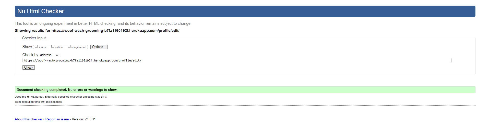
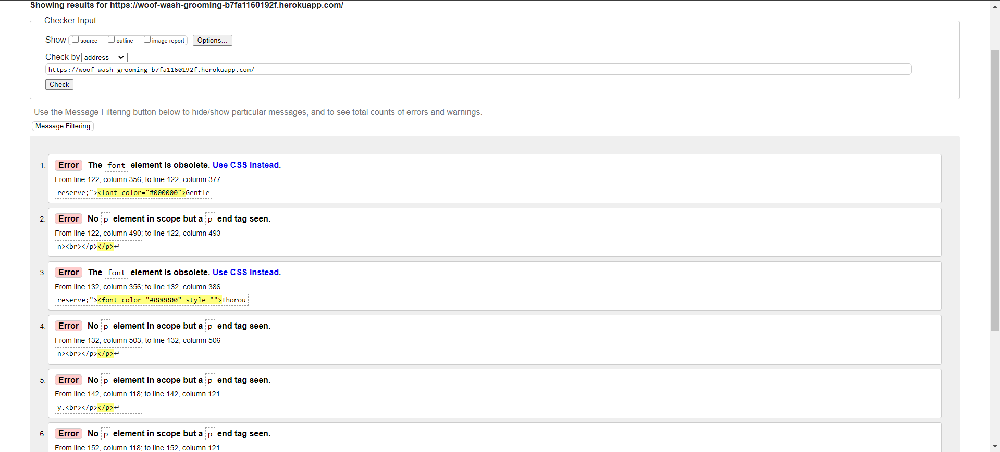
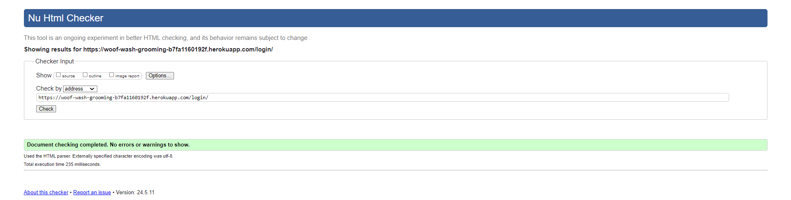
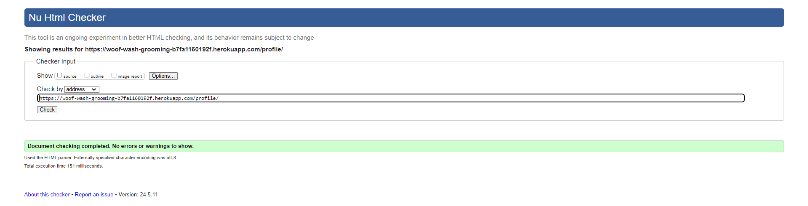
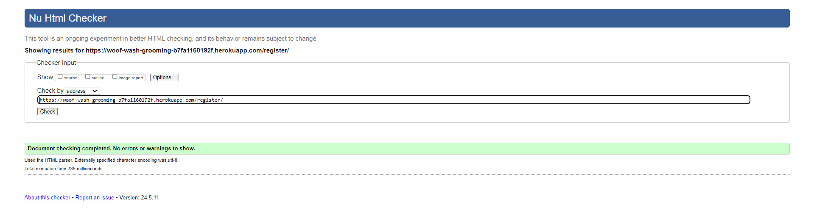
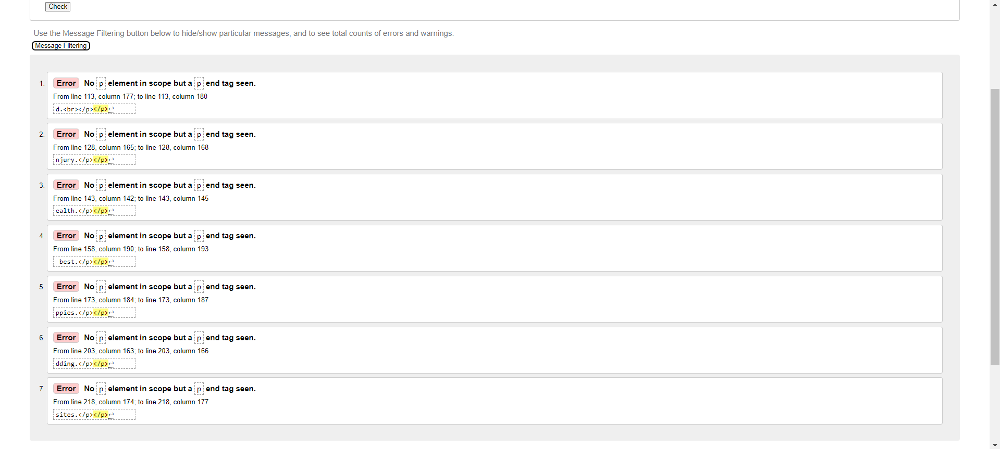
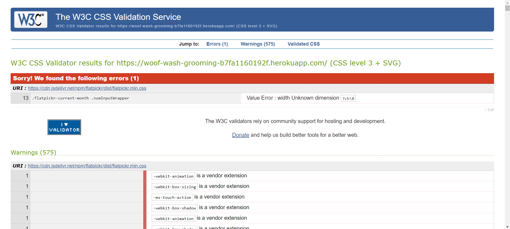

# Testing

> [!NOTE]  
> Return back to the [README.md](README.md) file.

## Code Validation

### HTML

I have used the recommended [HTML W3C Validator](https://validator.w3.org) to validate all of my HTML files.

| Directory | File | Screenshot                                                                       | Notes                                                                                                    |
| --- | --- |----------------------------------------------------------------------------------|----------------------------------------------------------------------------------------------------------|
| grooming_service | 404.html |          | Pass: No Errors                                                                                          |
| grooming_service | about.html |         | Pass: No Errors                                                                                          |
| grooming_service | appointment.html |   | Pass: No Errors                                                                                          |
| grooming_service | edit_profile.html |  | Pass: No Errors                                                                                          |
| grooming_service | home.html |          | I am aware of the errors on this page, the errors are due to summernote rendering the short description. |
| grooming_service | login.html |         | Pass: No Errors                                                                                          |
| grooming_service | profile.html |  | Pass: No Errors |                                                                                         |
| grooming_service | register.html |      | Pass: No Errors                                                                                          |
| grooming_service | services.html |      | I am aware of the errors on this page, the errors are caused when rendering the summernote descriptions. |

### CSS

I have used the recommended [CSS Jigsaw Validator](https://jigsaw.w3.org/css-validator) to validate all of my CSS files.

| Directory | File | Screenshot | Notes                                                                                                                                                                                          |
| --- | --- | --- |------------------------------------------------------------------------------------------------------------------------------------------------------------------------------------------------|
| static | style.css |  | I am aware of the error that occurs when running through the validator however, due to the error coming from the external flatpickr.css and not my own, I am unable to do anything about this. |
