# Testing

> [!NOTE]  
> Return back to the [README.md](README.md) file.

## Code Validation

### HTML

I have used the recommended [HTML W3C Validator](https://validator.w3.org) to validate all of my HTML files.

| Directory | File | Screenshot                                                                       | Notes                                                                                                    |
| --- | --- |----------------------------------------------------------------------------------|----------------------------------------------------------------------------------------------------------|
| grooming_service | 404.html |          | Pass: No Errors                                                                                          |
| grooming_service | about.html |         | Pass: No Errors                                                                                          |
| grooming_service | appointment.html | 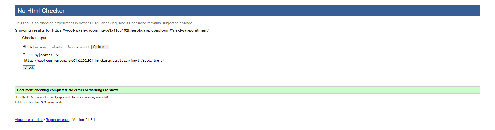  | Pass: No Errors                                                                                          |
| grooming_service | edit_profile.html | 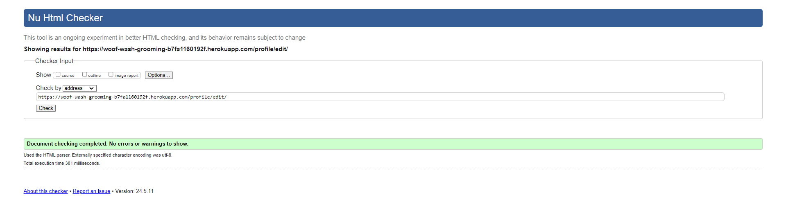 | Pass: No Errors                                                                                          |
| grooming_service | home.html |          | I am aware of the errors on this page, the errors are due to summernote rendering the short description. |
| grooming_service | login.html | 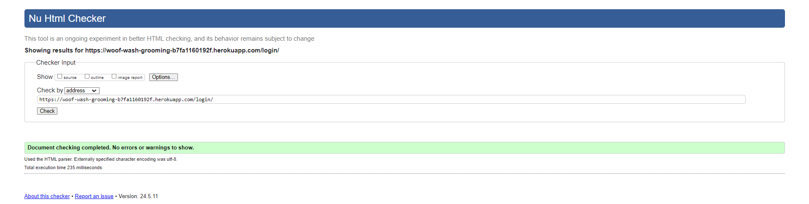        | Pass: No Errors                                                                                          |
| grooming_service | profile.html | 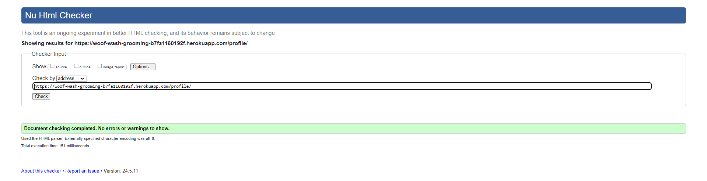 | Pass: No Errors |                                                                                         |
| grooming_service | register.html | 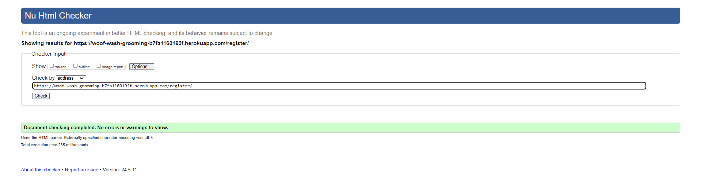     | Pass: No Errors                                                                                          |
| grooming_service | services.html | 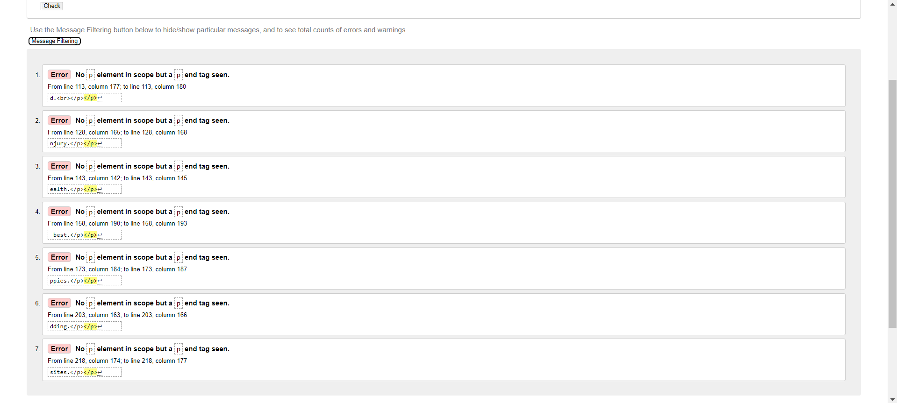     | I am aware of the errors on this page, the errors are caused when rendering the summernote descriptions. |

### CSS

I have used the recommended [CSS Jigsaw Validator](https://jigsaw.w3.org/css-validator) to validate all of my CSS files.

| Directory | File | Screenshot | Notes                                                                                                                                                                                          |
| --- | --- | --- |------------------------------------------------------------------------------------------------------------------------------------------------------------------------------------------------|
| static | style.css | 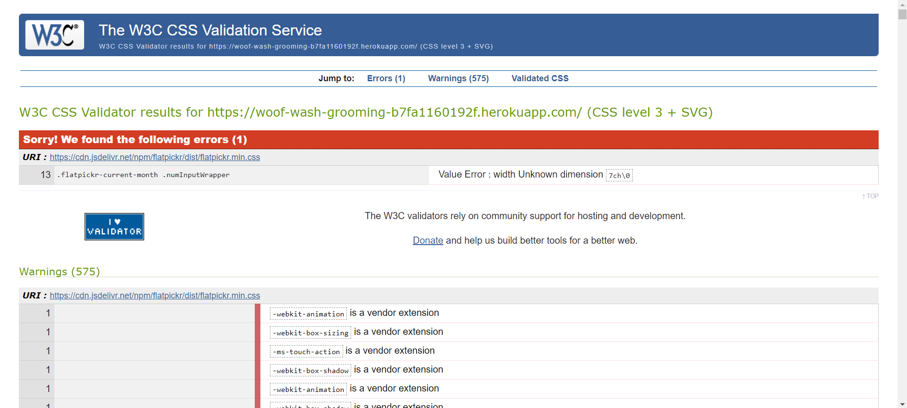 | I am aware of the error that occurs when running through the validator however, due to the error coming from the external flatpickr.css and not my own, I am unable to do anything about this. |

### JavaScript

I have used the recommended [JShint Validator](https://jshint.com) to validate all of my JS files.

| Directory | File | Screenshot                                                                  | Notes                                |
| --- | --- |-----------------------------------------------------------------------------|--------------------------------------|
| static | edit_profile.js | 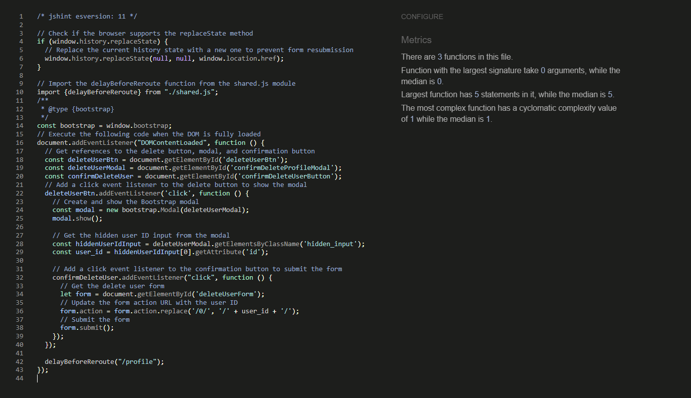 | Pass: No Errors                      |
| static | login.js | 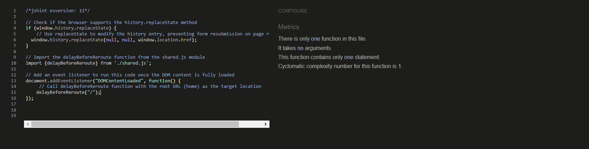  | Pass: No Errors                      |
| static | profile.js | 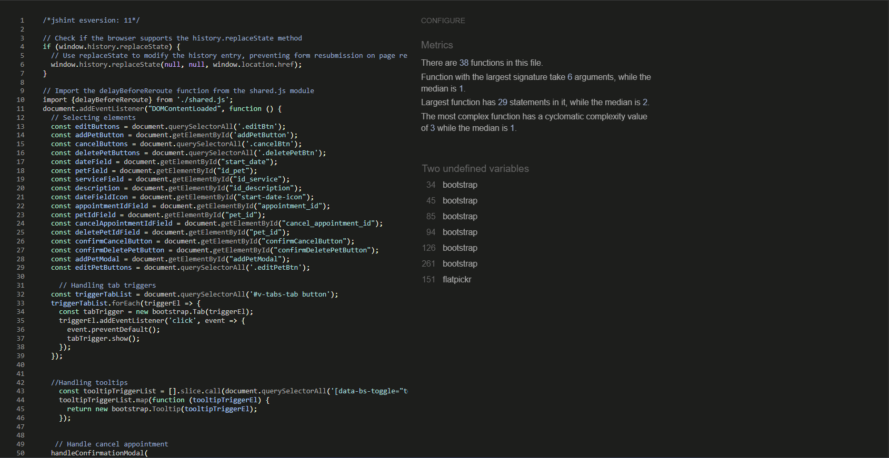 | Unused variables from external files |
| static | register.js | 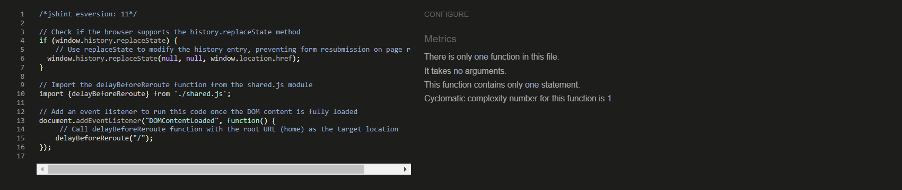 | Pass: No Errors                      |
| static | script.js | 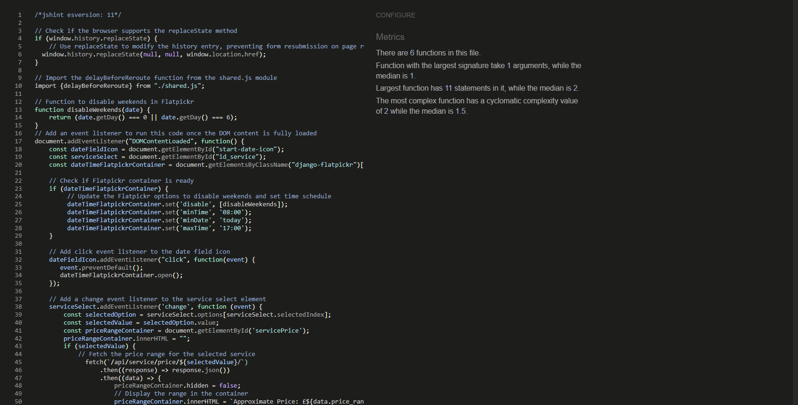 | Pass: No Errors                      |

### Python

I have used the recommended [PEP8 CI Python Linter](https://pep8ci.herokuapp.com) to validate all of my Python files.

| Directory | File | CI URL | Screenshot | Notes |
| --- | --- | --- | --- | --- |
| grooming_service | admin.py | [PEP8 CI](https://pep8ci.herokuapp.com/https://raw.githubusercontent.com/Jordan-Boulton1/woof-wash-grooming/main/grooming_service/admin.py) | 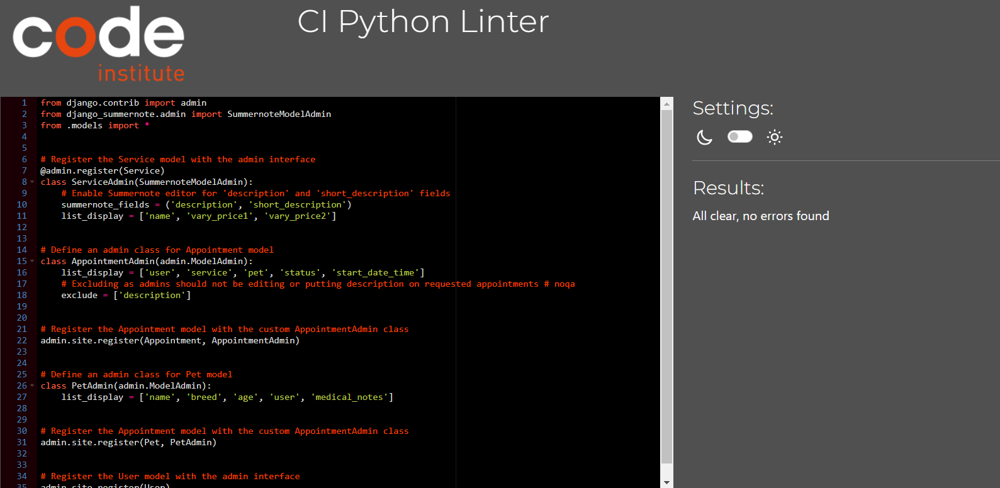 | Pass: No Errors |
| grooming_service | custom_user_manager.py | [PEP8 CI](https://pep8ci.herokuapp.com/https://raw.githubusercontent.com/Jordan-Boulton1/woof-wash-grooming/main/grooming_service/custom_user_manager.py) | 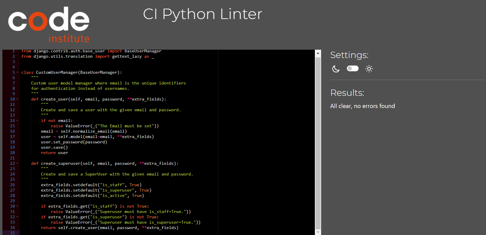 | Pass: No Errors |
| grooming_service | forms.py | [PEP8 CI](https://pep8ci.herokuapp.com/https://raw.githubusercontent.com/Jordan-Boulton1/woof-wash-grooming/main/grooming_service/forms.py) | 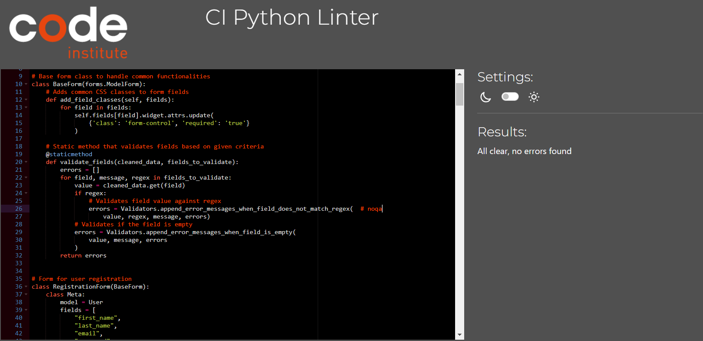 | Pass: No Errors |
| grooming_service | models.py | [PEP8 CI](https://pep8ci.herokuapp.com/https://raw.githubusercontent.com/Jordan-Boulton1/woof-wash-grooming/main/grooming_service/models.py) | 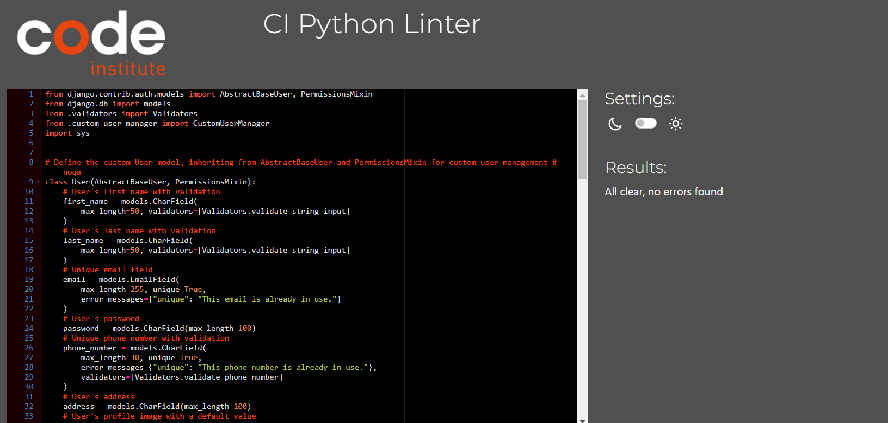 | Pass: No Errors |
| grooming_service | urls.py | [PEP8 CI](https://pep8ci.herokuapp.com/https://raw.githubusercontent.com/Jordan-Boulton1/woof-wash-grooming/main/grooming_service/urls.py) | 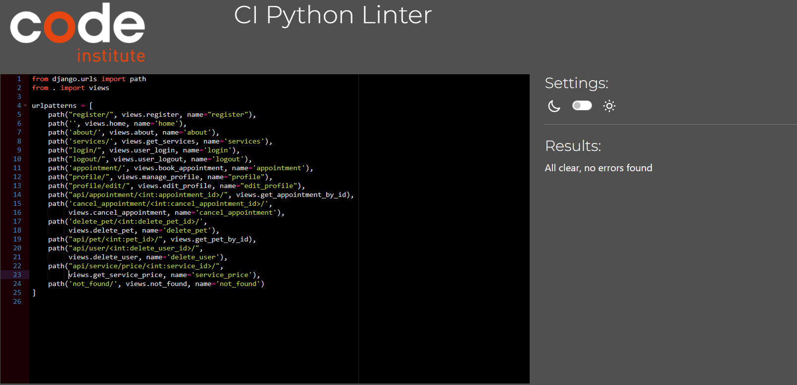 | Pass: No Errors |
| grooming_service | validators.py | [PEP8 CI](https://pep8ci.herokuapp.com/https://raw.githubusercontent.com/Jordan-Boulton1/woof-wash-grooming/main/grooming_service/validators.py) | 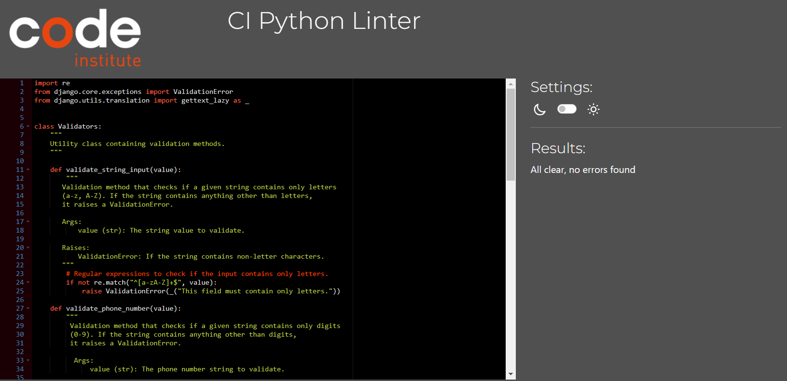 | Pass: No Errors|