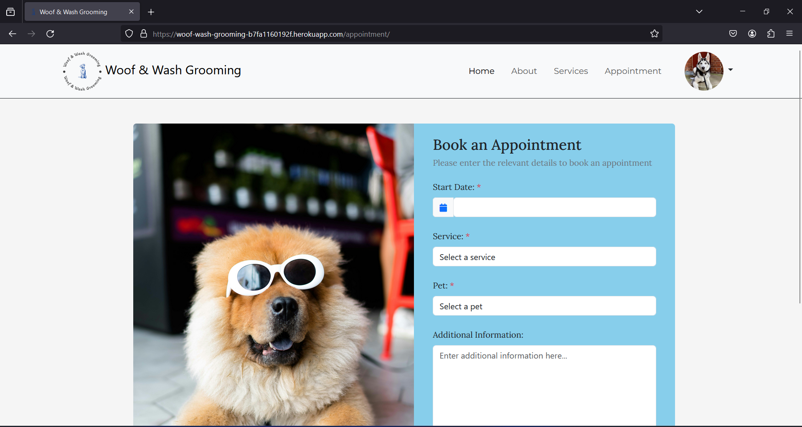
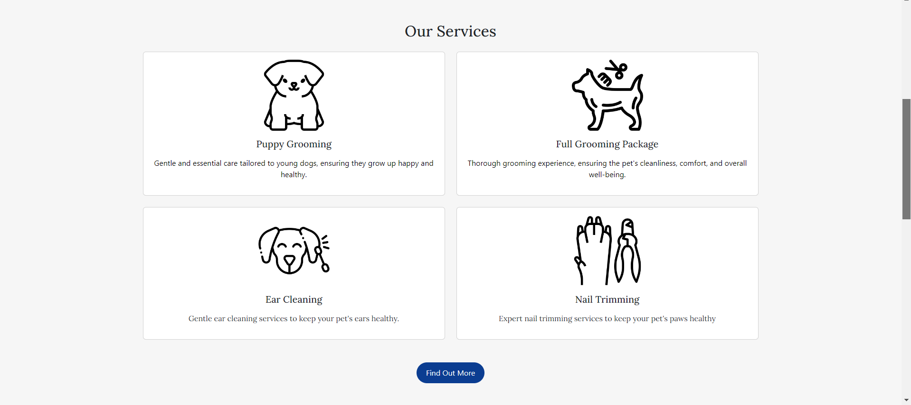
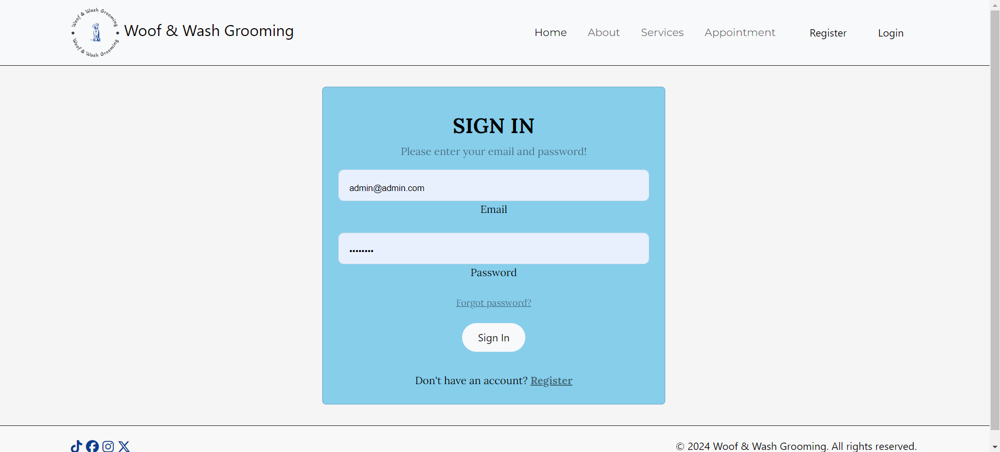
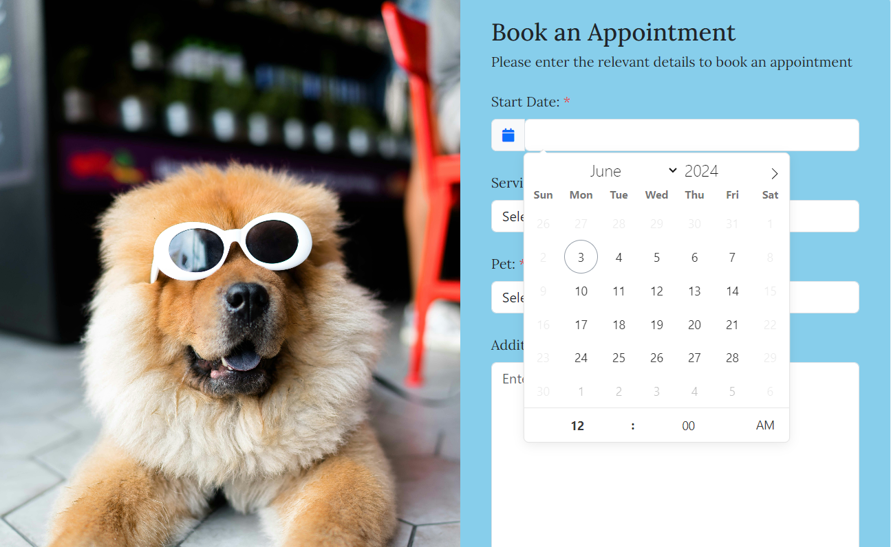
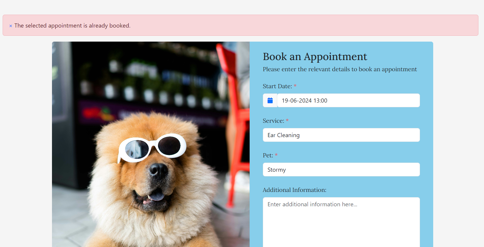

# Testing

> [!NOTE]  
> Return back to the [README.md](README.md) file.

## Code Validation

### HTML

I have used the recommended [HTML W3C Validator](https://validator.w3.org) to validate all of my HTML files.

| Directory | File | Screenshot                                                                       | Notes                                                                                                    |
| --- | --- |----------------------------------------------------------------------------------|----------------------------------------------------------------------------------------------------------|
| grooming_service | 404.html |          | Pass: No Errors                                                                                          |
| grooming_service | about.html |         | Pass: No Errors                                                                                          |
| grooming_service | appointment.html |   | Pass: No Errors                                                                                          |
| grooming_service | edit_profile.html |  | Pass: No Errors                                                                                          |
| grooming_service | home.html |          | I am aware of the errors on this page, the errors are due to summernote rendering the short description. |
| grooming_service | login.html |         | Pass: No Errors                                                                                          |
| grooming_service | profile.html |  | Pass: No Errors |                                                                                         |
| grooming_service | register.html |      | Pass: No Errors                                                                                          |
| grooming_service | services.html |      | I am aware of the errors on this page, the errors are caused when rendering the summernote descriptions. |

### CSS

I have used the recommended [CSS Jigsaw Validator](https://jigsaw.w3.org/css-validator) to validate all of my CSS files.

| Directory | File | Screenshot | Notes                                                                                                                                                                                          |
| --- | --- | --- |------------------------------------------------------------------------------------------------------------------------------------------------------------------------------------------------|
| static | style.css |  | I am aware of the error that occurs when running through the validator however, due to the error coming from the external flatpickr.css and not my own, I am unable to do anything about this. |

### JavaScript

I have used the recommended [JShint Validator](https://jshint.com) to validate all of my JS files.

| Directory | File | Screenshot                                                                  | Notes                                |
| --- | --- |-----------------------------------------------------------------------------|--------------------------------------|
| static | edit_profile.js |  | Pass: No Errors                      |
| static | login.js |   | Pass: No Errors                      |
| static | profile.js |  | Unused variables from external files |
| static | register.js |  | Pass: No Errors                      |
| static | script.js |  | Pass: No Errors                      |

### Python

I have used the recommended [PEP8 CI Python Linter](https://pep8ci.herokuapp.com) to validate all of my Python files.

| Directory | File | CI URL | Screenshot                                                                                | Notes |
| --- | --- | --- |-------------------------------------------------------------------------------------------| --- |
| grooming_service | admin.py | [PEP8 CI](https://pep8ci.herokuapp.com/https://raw.githubusercontent.com/Jordan-Boulton1/woof-wash-grooming/main/grooming_service/admin.py) |                | Pass: No Errors |
| grooming_service | custom_user_manager.py | [PEP8 CI](https://pep8ci.herokuapp.com/https://raw.githubusercontent.com/Jordan-Boulton1/woof-wash-grooming/main/grooming_service/custom_user_manager.py) |  | Pass: No Errors |
| grooming_service | forms.py | [PEP8 CI](https://pep8ci.herokuapp.com/https://raw.githubusercontent.com/Jordan-Boulton1/woof-wash-grooming/main/grooming_service/forms.py) |                | Pass: No Errors |
| grooming_service | models.py | [PEP8 CI](https://pep8ci.herokuapp.com/https://raw.githubusercontent.com/Jordan-Boulton1/woof-wash-grooming/main/grooming_service/models.py) |               | Pass: No Errors |
| grooming_service | urls.py | [PEP8 CI](https://pep8ci.herokuapp.com/https://raw.githubusercontent.com/Jordan-Boulton1/woof-wash-grooming/main/grooming_service/urls.py) |                 | Pass: No Errors |
| grooming_service | validators.py | [PEP8 CI](https://pep8ci.herokuapp.com/https://raw.githubusercontent.com/Jordan-Boulton1/woof-wash-grooming/main/grooming_service/validators.py) |                      | Pass: No Errors|
| grooming_service | views.py | [PEP8 CI](https://pep8ci.herokuapp.com/https://raw.githubusercontent.com/Jordan-Boulton1/woof-wash-grooming/main/grooming_service/views.py) |                             | |
|  | manage.py | [PEP8 CI](https://pep8ci.herokuapp.com/https://raw.githubusercontent.com/Jordan-Boulton1/woof-wash-grooming/main/manage.py) |               | Pass: No Errors |
| woof_wash_grooming | settings.py | [PEP8 CI](https://pep8ci.herokuapp.com/https://raw.githubusercontent.com/Jordan-Boulton1/woof-wash-grooming/main/woof_wash_grooming/settings.py) |             | Pass: No Errors |
| woof_wash_grooming | urls.py | [PEP8 CI](https://pep8ci.herokuapp.com/https://raw.githubusercontent.com/Jordan-Boulton1/woof-wash-grooming/main/woof_wash_grooming/urls.py) |                | Pass: No Errors |

## Browser Compatibility

I've tested my deployed project on multiple browsers to check for compatibility issues.

| Browser | Home                                                                   | About                                                                       | Services                                                                  | Appointment                                                                  | Profile                                                                  | Edit Profile                                                                  | Register                                                                  | Login                                                                  | 404 Error Page                                                       | Notes |
| --- |------------------------------------------------------------------------|-----------------------------------------------------------------------------|---------------------------------------------------------------------------|------------------------------------------------------------------------------|--------------------------------------------------------------------------|-------------------------------------------------------------------------------|---------------------------------------------------------------------------|------------------------------------------------------------------------|----------------------------------------------------------------------| --- |
| Chrome |   |  |  |  |  |  |  |  |  | Works as expected |
| Firefox|  |  |  |  |  |  |  |  |  | Works as expected |
| Edge |     |  |  |  |  |  |  |  |  | Works as expected |
| Safari |  |  |  |  |  |  |  |  |  | Minor CSS differences |

## Responsiveness

I've tested my deployed project on multiple devices to check for responsiveness issues.

| Device| Home | About | Services | Appointment | Profile | Edit Profile | Register | Login | 404 Error Page                                                                 | Notes |
| --- | --- | --- | --- | --- | --- | --- | --- | --- |--------------------------------------------------------------------------------| --- |
| Mobile (DevTools) |  |  |  |  |  |  |  |  |   | Works as expected |
| Tablet (DevTools) |  |  |  |  |  |  |  |  |   | Works as expected |
| Desktop |  |  |  |  |  |  |  |  |  | Works as expected |
| iPhone 11 |  |  |  |  |  |  |  |  |  | Works as expected |

## Lighthouse Audit

I've tested my deployed project using the Lighthouse Audit tool to check for any major issues.

| Page | Mobile | Desktop | Notes |
| --- | --- | --- | --- |
| Home |  |  | Slow response time due to large images and some warnings due to 3rd party plugins |
| About |  |  | Slow response time due to large image and some warnings due to 3rd party plugins |
| Services|  |  | HTTP/2 Errors appearing in the lighthouse validation due to heroku not supporting that version of the protocol. [See link](https://help.heroku.com/JAOCNZ25/does-heroku-have-plans-to-support-http-2) |
| Appointment|  |  | Some warnings due to 3rd party plugins and also some warnings due to names and labels that are being generated through django |
| Register|  |  | Some warnings due to 3rd party plugins |
| Login|  |  | Some minor warnings |
| Profile|  |  | Some warnings due to 3rd party plugins |
| Edit Profile|  |  | Some warnings due to 3rd party plugins |
| 404 Page |  |  | Some warnings due to 3rd party plugins |

## Defensive Programming

| Page | Expectation | Test | Result | Fix | Screenshot                                                  |
| --- | --- | --- | --- | --- |-------------------------------------------------------------|
| Home | | | | |                                                             |
| | ***Find out more*** button in the ***Our Services*** section of the ***Home*** page is expected to redirect the  user to the ***Services*** page.| Tested the feature by clicking the button and ensuring that it correctly navigates to the expected view. In addition, unit tests were written for the specific view that is responsible for rendering the ***Services*** page with the expectations that it correctly returns 200 OK and the expected HTML template | The feature behaved as expected, and it did redirected the user| Test concluded and passed |  |
| | ***Our services*** section in the ***Home*** page is expected to render 4 featured services that only have short description and a corresponding image. | Tested the feature by navigating to that section of the ***Home*** page and ensuring that the images and short description correspond with what has been saved in the database. In addition, unit tests were written for the specific view that is responsible for rendering the featured services with the expectations that it correctly returns 200 OK and the expected featured services| The feature behaved as expected, and it rendered only the 4 expected services that have short description| Test concluded and passed |  |
| | ***Learn More About Us*** button in the ***About us*** section of the ***Home*** page is expected to redirect the user to the ***About*** page. | Tested the feature by clicking the button and ensuring that it correctly navigates to the expected view. In addition, unit tests were written for the specific view that is responsible for rendering the ***About*** page with the expectations that it correctly returns 200 OK and the expected HTML template| The feature behaved as expected, and it did redirected the user | Test concluded and passed |  |
| | ***Schedule Appointment*** button in the ***Contact Us*** section is expected to redirect the user to the ***Appointment*** page. | Tested the feature by clicking the button and ensure that it correctly navigates to the expected view. In addition, unit tests were written for the specific view that is responsible for rendering the ***Appointment*** page with the expectations that it correctly returns 200 OK and the expected HTML template | The feature behaved as expected, and it did redirect the user | Test concluded and passed |  |
| Services | | | | |                                                             |
| | ***Our Grooming Services*** on the ***Services*** page is expected to render all available services from the database with the correct images, description and price. | Tested the feature by navigating to the page and ensuring that the images, description and approximate price correspond with what has been saved in the database. In addition, unit tests were written for the specific view that is responsible for rendering all  services with the expectations that it correctly returns 200 OK and the all services| The feature behaved as expected, and rendered all available services | Test concluded and passed |  |
| | ***About Our Prices*** on the ***Services*** page is expected to redirect the user to the section ***Contact Us*** on the ***Home*** page when the user click the hyperlinked text ***Contact Us***.| Tested the feature by navigating to the ***Contact us*** section on the ***About Our Prices*** page and ensuring that when the hyperlinked text is clicked the user is successfully redirected to the ***Home*** page and to the ***Contact Us*** section.| The feature behaved as expected, and it redirected the user to the correct section of the ***Home*** page | Test concluded and passed |  |
| | ***Gallery*** on the ***Services*** page is expected to render 6 images in a Bootstrap carousel that allows user  to slide over.| Tested the feature by navigating to the ***Gallery*** section on the ***Services*** page and ensuring that the images were loaded correctly and the Bootstrap carousel was interactive.| The feature behaved as expected, and it rendered the expected images in a Bootstrap carousel. | Test concluded and passed |  |
| Appointment | | | | | |
| | ***Appointment*** page is expected to only render the appointment form when a user is logged in successfully. | Tested the feature by navigating to the page with an authenticated user and ensuring that the form for booking an appointment is rendered correctly. In addition, unit tests were written for the specific view that is responsible for rendering the appointment form with the expectations that it correctly returns 200 OK and the form. | The feature behaved as expected, and the form was rendered| Test concluded and passed |  |
| | ***Appointment*** page is expected to only render the appointment form when a user is logged in successfully. If the user is not logged in, it should redirect to the login page. | Tested the feature by navigating to the page with an unauthenticated user and ensuring it redirects to the login page. In addition, unit tests were written for the specific view responsible for rendering the appointment form and redirection logic with expectations that it correctly returning 302 and authenticated users were redirected to the login. | The feature behaved as expected, and the form was rendered| Test concluded and passed | |
| | The form in the ***Appointment*** page is expected to prevent the user from submitting an empty form. | Tested the feature by leaving the form empty and clicking the ***Submit*** button in the form. | The feature behaved as expected, and the form correctly hinted the user that the fields cannot be empty. | Test concluded and passed | |
| | The form in the ***Appointment*** page is expected to show a ***DateTime*** picker with past dates unavailable, weekends unavailable and minimum time of 8:00 AM and 17:00 PM when the user clicks on either the calendar icon or the input. | The feature behaved as expected when the calendar icon was clicked but not when the input was clicked.| The code had to be adjusted so the filtering of the days and time had to be done outside of the ***click*** listener on the icon so that both the input and the icon were applying the rules | Test concluded and passed | |
| | The form in the ***Appointment*** page is expected to submit the form when the user clicks the ***Book Appointment*** button and then redirected to the profile page.| Tested the feature by providing valid data to the form and clicking the ***Book Appointment*** button. In addition, unit tests were written for the specific view responsible for handling the POST request by submitting the appointment form with expectations that it creates the appointment for the user and a success message is shown above the form. | The feature behaved as expected, a new appointment for the user was created and a success message was rendered .| Test concluded and passed |  |
| | | | | | 
| | The form in the ***Appointment*** page is expected to return error message when the user tries to book an appointment date and time that is already booked.| Tested the feature by attempting to book an appointment with a date and time of an already existing one. In addition, unit tests were written for the specific view responsible for handling the POST request by submitting the appointment form with expectations that it does not create the appointment for the user and error message is shown above the form. | The feature behaved as expected, a new appointment was not created for the user was created and a error message was rendered .| Test concluded and passed | |