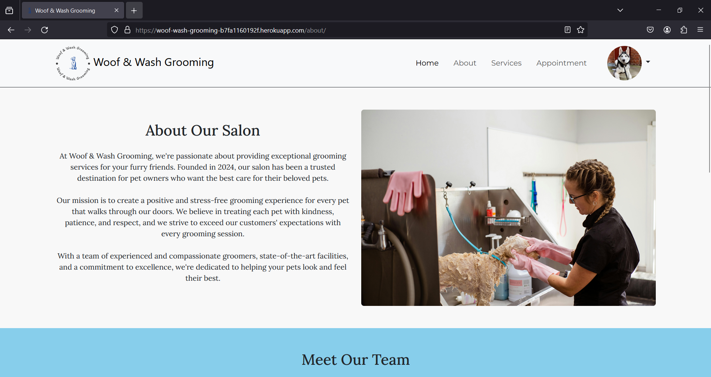
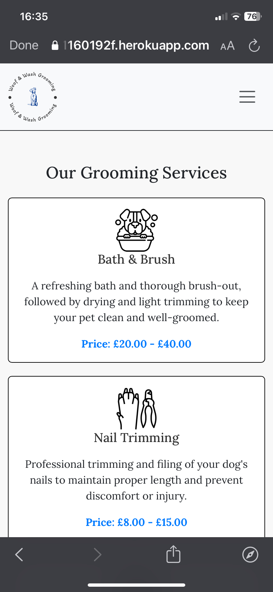
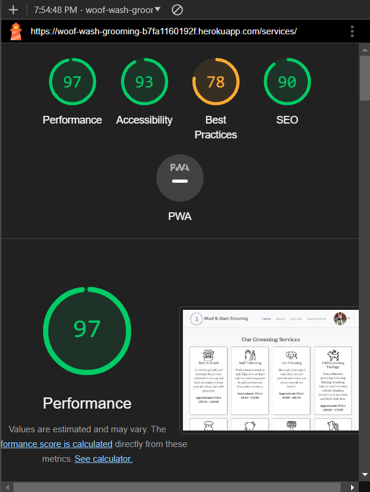
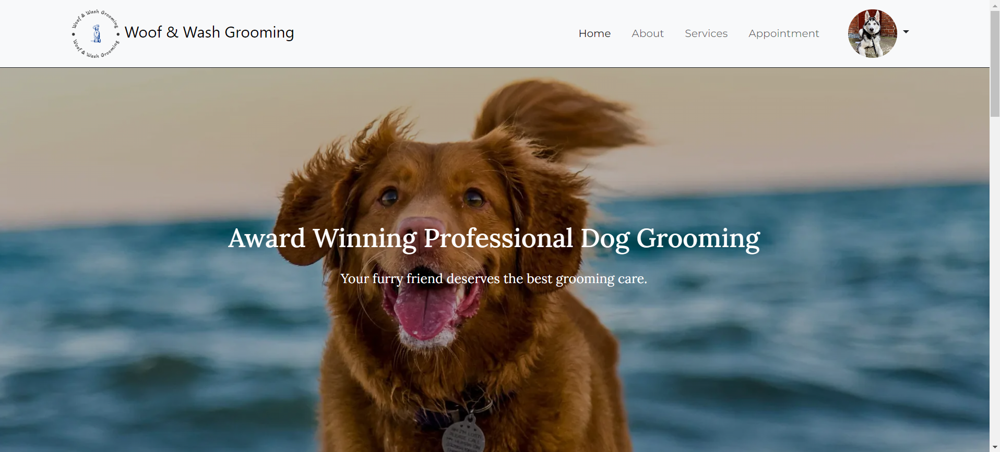
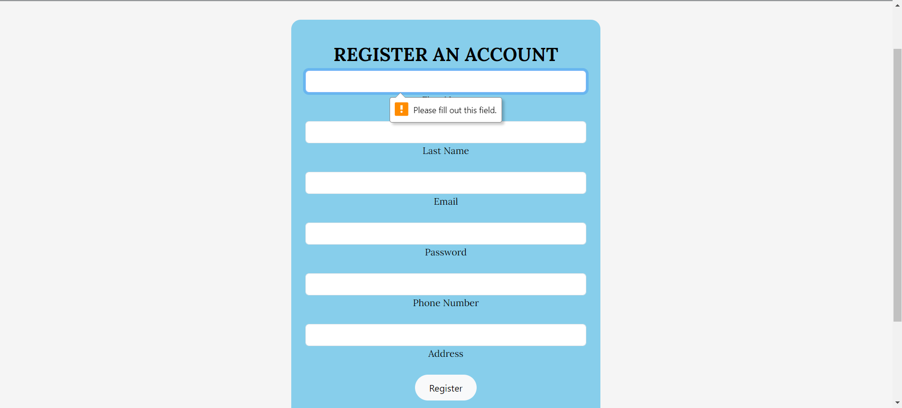
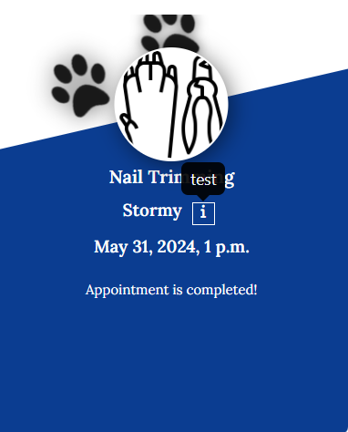
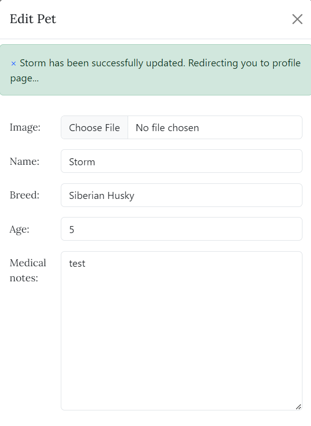

# Testing

> [!NOTE]  
> Return back to the [README.md](README.md) file.

## Code Validation

### HTML

I have used the recommended [HTML W3C Validator](https://validator.w3.org) to validate all of my HTML files.

| Directory | File | Screenshot                                                                       | Notes                                                                                                    |
| --- | --- |----------------------------------------------------------------------------------|----------------------------------------------------------------------------------------------------------|
| grooming_service | 404.html |          | Pass: No Errors                                                                                          |
| grooming_service | about.html |         | Pass: No Errors                                                                                          |
| grooming_service | appointment.html |   | Pass: No Errors                                                                                          |
| grooming_service | edit_profile.html |  | Pass: No Errors                                                                                          |
| grooming_service | home.html |          | I am aware of the errors on this page, the errors are due to summernote rendering the short description. |
| grooming_service | login.html |         | Pass: No Errors                                                                                          |
| grooming_service | profile.html |  | Pass: No Errors |                                                                                         |
| grooming_service | register.html |      | Pass: No Errors                                                                                          |
| grooming_service | services.html |      | I am aware of the errors on this page, the errors are caused when rendering the summernote descriptions. |

### CSS

I have used the recommended [CSS Jigsaw Validator](https://jigsaw.w3.org/css-validator) to validate all of my CSS files.

| Directory | File | Screenshot | Notes                                                                                                                                                                                          |
| --- | --- | --- |------------------------------------------------------------------------------------------------------------------------------------------------------------------------------------------------|
| static | style.css |  | I am aware of the error that occurs when running through the validator however, due to the error coming from the external flatpickr.css and not my own, I am unable to do anything about this. |

### JavaScript

I have used the recommended [JShint Validator](https://jshint.com) to validate all of my JS files.

| Directory | File | Screenshot                                                                  | Notes                                |
| --- | --- |-----------------------------------------------------------------------------|--------------------------------------|
| static | edit_profile.js |  | Pass: No Errors                      |
| static | login.js |   | Pass: No Errors                      |
| static | profile.js |  | Unused variables from external files |
| static | register.js |  | Pass: No Errors                      |
| static | script.js |  | Pass: No Errors                      |

### Python

I have used the recommended [PEP8 CI Python Linter](https://pep8ci.herokuapp.com) to validate all of my Python files.

| Directory          | File                   | CI URL | Screenshot                                                                                | Notes           |
|--------------------|------------------------| --- |-------------------------------------------------------------------------------------------|-----------------|
| grooming_service   | admin.py               | [PEP8 CI](https://pep8ci.herokuapp.com/https://raw.githubusercontent.com/Jordan-Boulton1/woof-wash-grooming/main/grooming_service/admin.py) |                | Pass: No Errors |
| grooming_service   | custom_user_manager.py | [PEP8 CI](https://pep8ci.herokuapp.com/https://raw.githubusercontent.com/Jordan-Boulton1/woof-wash-grooming/main/grooming_service/custom_user_manager.py) |  | Pass: No Errors |
| grooming_service   | forms.py               | [PEP8 CI](https://pep8ci.herokuapp.com/https://raw.githubusercontent.com/Jordan-Boulton1/woof-wash-grooming/main/grooming_service/forms.py) |                | Pass: No Errors |
| grooming_service   | models.py              | [PEP8 CI](https://pep8ci.herokuapp.com/https://raw.githubusercontent.com/Jordan-Boulton1/woof-wash-grooming/main/grooming_service/models.py) |               | Pass: No Errors |
| grooming_service   | urls.py                | [PEP8 CI](https://pep8ci.herokuapp.com/https://raw.githubusercontent.com/Jordan-Boulton1/woof-wash-grooming/main/grooming_service/urls.py) |                 | Pass: No Errors |
| grooming_service   | validators.py          | [PEP8 CI](https://pep8ci.herokuapp.com/https://raw.githubusercontent.com/Jordan-Boulton1/woof-wash-grooming/main/grooming_service/validators.py) |                      | Pass: No Errors |
| grooming_service   | views.py               | [PEP8 CI](https://pep8ci.herokuapp.com/https://raw.githubusercontent.com/Jordan-Boulton1/woof-wash-grooming/main/grooming_service/views.py) |                | Pass: No Errors |
| grooming_service   | custom_filters.py      | [PEP8 CI](https://pep8ci.herokuapp.com/https://raw.githubusercontent.com/Jordan-Boulton1/woof-wash-grooming/main/grooming_service/templatetags/custom_filters.py) |       | Pass: No Errors |
| woof_wash_grooming | manage.py              | [PEP8 CI](https://pep8ci.herokuapp.com/https://raw.githubusercontent.com/Jordan-Boulton1/woof-wash-grooming/main/manage.py) |               | Pass: No Errors |
| woof_wash_grooming | settings.py            | [PEP8 CI](https://pep8ci.herokuapp.com/https://raw.githubusercontent.com/Jordan-Boulton1/woof-wash-grooming/main/woof_wash_grooming/settings.py) |             | Pass: No Errors |
| woof_wash_grooming | urls.py                | [PEP8 CI](https://pep8ci.herokuapp.com/https://raw.githubusercontent.com/Jordan-Boulton1/woof-wash-grooming/main/woof_wash_grooming/urls.py) |                | Pass: No Errors |

## Browser Compatibility

I've tested my deployed project on multiple browsers to check for compatibility issues.

| Browser | Home                                                                   | About                                                                       | Services                                                                  | Appointment                                                                  | Profile                                                                  | Edit Profile                                                                  | Register                                                                  | Login                                                                  | 404 Error Page                                                       | Notes |
| --- |------------------------------------------------------------------------|-----------------------------------------------------------------------------|---------------------------------------------------------------------------|------------------------------------------------------------------------------|--------------------------------------------------------------------------|-------------------------------------------------------------------------------|---------------------------------------------------------------------------|------------------------------------------------------------------------|----------------------------------------------------------------------| --- |
| Chrome |   |  |  |  |  |  |  |  |  | Works as expected |
| Firefox|  |  |  |  |  |  |  |  |  | Works as expected |
| Edge |     |  |  |  |  |  |  |  |  | Works as expected |
| Safari |  |  |  |  |  |  |  |  |  | Minor CSS differences |

## Responsiveness

I've tested my deployed project on multiple devices to check for responsiveness issues.

| Device| Home | About | Services | Appointment | Profile | Edit Profile | Register | Login | 404 Error Page                                                                 | Notes |
| --- | --- | --- | --- | --- | --- | --- | --- | --- |--------------------------------------------------------------------------------| --- |
| Mobile (DevTools) |  |  |  |  |  |  |  |  |   | Works as expected |
| Tablet (DevTools) |  |  |  |  |  |  |  |  |   | Works as expected |
| Desktop |  |  |  |  |  |  |  |  |  | Works as expected |
| iPhone 11 |  |  |  |  |  |  |  |  |  | Works as expected |

## Lighthouse Audit

I've tested my deployed project using the Lighthouse Audit tool to check for any major issues.

| Page | Mobile | Desktop | Notes |
| --- | --- | --- | --- |
| Home |  |  | Slow response time due to large images and some warnings due to 3rd party plugins |
| About |  |  | Slow response time due to large image and some warnings due to 3rd party plugins |
| Services|  |  | HTTP/2 Errors appearing in the lighthouse validation due to heroku not supporting that version of the protocol. [See link](https://help.heroku.com/JAOCNZ25/does-heroku-have-plans-to-support-http-2) |
| Appointment|  |  | Some warnings due to 3rd party plugins and also some warnings due to names and labels that are being generated through django |
| Register|  |  | Some warnings due to 3rd party plugins |
| Login|  |  | Some minor warnings |
| Profile|  |  | Some warnings due to 3rd party plugins |
| Edit Profile|  |  | Some warnings due to 3rd party plugins |
| 404 Page |  |  | Some warnings due to 3rd party plugins |

## Defensive Programming

| Page | Expectation | Test | Result | Fix | Screenshot                                                  |
| --- | --- | --- | --- | --- |-------------------------------------------------------------|
| Home | | | | |                                                             |
| | ***Find out more*** button in the ***Our Services*** section of the ***Home*** page is expected to redirect the  user to the ***Services*** page.| Tested the feature by clicking the button and ensuring that it correctly navigates to the expected view. In addition, unit tests were written for the specific view that is responsible for rendering the ***Services*** page with the expectations that it correctly returns 200 OK and the expected HTML template | The feature behaved as expected, and it did redirected the user| Test concluded and passed |  |
| | ***Our services*** section in the ***Home*** page is expected to render 4 featured services that only have short description and a corresponding image. | Tested the feature by navigating to that section of the ***Home*** page and ensuring that the images and short description correspond with what has been saved in the database. In addition, unit tests were written for the specific view that is responsible for rendering the featured services with the expectations that it correctly returns 200 OK and the expected featured services| The feature behaved as expected, and it rendered only the 4 expected services that have short description| Test concluded and passed |  |
| | ***Learn More About Us*** button in the ***About us*** section of the ***Home*** page is expected to redirect the user to the ***About*** page. | Tested the feature by clicking the button and ensuring that it correctly navigates to the expected view. In addition, unit tests were written for the specific view that is responsible for rendering the ***About*** page with the expectations that it correctly returns 200 OK and the expected HTML template| The feature behaved as expected, and it did redirected the user | Test concluded and passed |  |
| | ***Schedule Appointment*** button in the ***Contact Us*** section is expected to redirect the user to the ***Appointment*** page. | Tested the feature by clicking the button and ensure that it correctly navigates to the expected view. In addition, unit tests were written for the specific view that is responsible for rendering the ***Appointment*** page with the expectations that it correctly returns 200 OK and the expected HTML template | The feature behaved as expected, and it did redirect the user | Test concluded and passed |  |
| Services | | | | |                                                             |
| | ***Our Grooming Services*** on the ***Services*** page is expected to render all available services from the database with the correct images, description and price. | Tested the feature by navigating to the page and ensuring that the images, description and approximate price correspond with what has been saved in the database. In addition, unit tests were written for the specific view that is responsible for rendering all  services with the expectations that it correctly returns 200 OK and the all services| The feature behaved as expected, and rendered all available services | Test concluded and passed |  |
| | ***About Our Prices*** on the ***Services*** page is expected to redirect the user to the section ***Contact Us*** on the ***Home*** page when the user click the hyperlinked text ***Contact Us***.| Tested the feature by navigating to the ***Contact us*** section on the ***About Our Prices*** page and ensuring that when the hyperlinked text is clicked the user is successfully redirected to the ***Home*** page and to the ***Contact Us*** section.| The feature behaved as expected, and it redirected the user to the correct section of the ***Home*** page | Test concluded and passed |  |
| | ***Gallery*** on the ***Services*** page is expected to render 6 images in a Bootstrap carousel that allows user  to slide over.| Tested the feature by navigating to the ***Gallery*** section on the ***Services*** page and ensuring that the images were loaded correctly and the Bootstrap carousel was interactive.| The feature behaved as expected, and it rendered the expected images in a Bootstrap carousel. | Test concluded and passed |  |
| Appointment | | | | |                                                             |
| | ***Appointment*** page is expected to only render the appointment form when a user is logged in successfully. | Tested the feature by navigating to the page with an authenticated user and ensuring that the form for booking an appointment is rendered correctly. In addition, unit tests were written for the specific view that is responsible for rendering the appointment form with the expectations that it correctly returns 200 OK and the form. | The feature behaved as expected, and the form was rendered| Test concluded and passed |  |
| | ***Appointment*** page is expected to only render the appointment form when a user is logged in successfully. If the user is not logged in, it should redirect to the login page. | Tested the feature by navigating to the page with an unauthenticated user and ensuring it redirects to the login page. In addition, unit tests were written for the specific view responsible for rendering the appointment form and redirection logic with expectations that it correctly returning 302 and authenticated users were redirected to the login. | The feature behaved as expected, and the form was rendered| Test concluded and passed |  |
| | The form in the ***Appointment*** page is expected to prevent the user from submitting an empty form. | Tested the feature by leaving the form empty and clicking the ***Submit*** button in the form. | The feature behaved as expected, and the form correctly hinted the user that the fields cannot be empty. | Test concluded and passed |  |
| | The form in the ***Appointment*** page is expected to show a ***DateTime*** picker with past dates unavailable, weekends unavailable and minimum time of 8:00 AM and 17:00 PM when the user clicks on either the calendar icon or the input. | The feature behaved as expected when the calendar icon was clicked but not when the input was clicked.| The code had to be adjusted so the filtering of the days and time had to be done outside of the ***click*** listener on the icon so that both the input and the icon were applying the rules | Test concluded and passed |  |
| | The form in the ***Appointment*** page is expected to submit the form when the user clicks the ***Book Appointment*** button and then redirected to the profile page.| Tested the feature by providing valid data to the form and clicking the ***Book Appointment*** button. In addition, unit tests were written for the specific view responsible for handling the POST request by submitting the appointment form with expectations that it creates the appointment for the user and a success message is shown above the form. | The feature behaved as expected, a new appointment for the user was created and a success message was rendered .| Test concluded and passed |  |
| | | | | |  
| | The form in the ***Appointment*** page is expected to return error message when the user tries to book an appointment date and time that is already booked.| Tested the feature by attempting to book an appointment with a date and time of an already existing one. In addition, unit tests were written for the specific view responsible for handling the POST request by submitting the appointment form with expectations that it does not create the appointment for the user and error message is shown above the form. | The feature behaved as expected, a new appointment was not created for the user was created and a error message was rendered .| Test concluded and passed |  |
| Login | | | | |                                                             |
| | ***Login*** page is expected to render the login form for user authentication. | Tested the feature by navigating to the page and ensuring the form is rendered correctly. Unit tests were written for the view responsible for rendering the login form with expectations of returning 200 OK and the form. | The feature behaved as expected, and the form was rendered. | Test concluded and passed |  |
| | ***Login*** page is expected to prevent the user from submitting an empty form. | Tested by leaving the form empty and clicking the ***Sign In*** button. |The feature behaved as expected, hinting the user that the fields cannot be empty. | Test concluded and passed |  |
| | ***Login*** page is expected to redirect to the homepage upon successful login with success message. | Tested by logging in with valid credentials and verifying redirection to the homepage. Unit tests confirmed the view handling the login correctly authenticates the user. |The feature behaved as expected and authenticated the user successfully. | Test concluded and passed |  |
| | | | | |  
| | ***Login*** page is expected to display an error message for invalid credentials. | Tested by attempting to log in with invalid credentials and verifying the error message display. Unit tests confirmed the view handling the login returns an error message. | The feature behaved as expected, showing an error message. | Test concluded and passed |  |
| | ***Login*** page is expected to redirect the user to 404 Not found page when the user clicks on ***Forgot Password?*** hyperlinked text. | Tested by clicking the ***Forgot Password?*** hyperlinked text and confirming that the user is correctly redirected to the 404 page. | The feature behaved as expected, redirecting the user. | Test concluded and passed |  |
| | ***Login*** page is expected to redirect the user to ***Register*** page when the user clicks on ***Don't have an account? Register*** hyperlinked text. | Tested by clicking the ***Don't have an account? Register*** hyperlinked text and confirming that the user is correctly redirected to the register page. | The feature behaved as expected, redirecting the user. | Test concluded and passed |  |
| Register | | | | |                                                             |
| | The ***Register*** page is expected to validate all user inputs before submission to ensure data integrity and prevent errors. | Tested by entering various invalid inputs (e.g., empty fields, incorrect email format, empty password) and attempting to submit the form. Confirmed that appropriate error messages are displayed, and form submission is prevented. Unit tests confirmed the view handling the register form returns error messages respectively. | The feature correctly displayed error messages and prevented form submission for invalid inputs. | Test concluded and passed |  |
| | The ***Register*** page is expected to securely store user passwords using encryption. | Tested by registering a new user and verifying that the password is encrypted in the database. Confirmed that the raw password is not stored. | The feature securely encrypted the password before storing it in the database. | Test concluded and passed |  |
| | The ***Register*** page is expected to prevent multiple accounts with the same email address. | Tested by attempting to register with an email address already in use. Confirmed that the system prevented the registration and displayed an appropriate error message. Unit tests confirmed the view handling the register form returns error messages that the email is already in use.  | The feature correctly identified duplicate email addresses and prevented registration. | Test concluded and passed |  |
| | The ***Register*** page is expected to prevent multiple accounts with the same phone number. | Tested by attempting to register with a phone number already in use. Confirmed that the system prevented the registration and displayed an appropriate error message. Unit tests confirmed the view handling the register form returns error messages that the phone number is already in use.  | The feature correctly identified duplicate phone numbers and prevented registration. | Test concluded and passed |  |
| | The ***Register*** page is expected to confirm successful registration, log the user in and redirect the user to the home page. | Tested by completing the registration form with valid inputs and submitting it. Confirmed that a success message was displayed, the user was logged in and the user was redirected to the home page. Unit tests confirmed the view handling the register form successfully authenticates the user upon valid registration.  | The feature successfully registered the user, logged the user in, displayed a confirmation message, and redirected to the homepage. | Test concluded and passed |  |
| | | | | |  
| Navbar Profile Image| | | | |                                                             |
| | The ***Navbar Profile Image*** is expected to be displayed when a user is logged in. | Tested by logging in with a valid user account and confirming that the profile image appears in the navbar. Also tested by logging out and confirming that the profile image is hidden and replaced with the Register and Login buttons. |The feature correctly displayed the profile image when logged in and hid it when logged out. | Test concluded and passed |  |
| | The ***Navbar Profile Image*** is expected to render a default image when a user has not uploaded an image of their account. | Tested by logging in with a valid user account that has not uploaded an image yet and confirming that the profile image is the default one. |The feature correctly displayed the default profile image when logged in. | Test concluded and passed |  |
| | The ***Navbar Profile Image*** is expected to render the image a user has uploaded to their account. | Tested by logging in with a valid user account and uploading an image, and confirming that the profile image is the one that the user has uploaded. |The feature correctly displayed the uploaded profile image. | Test concluded and passed |  |
| | | | | |  
| | | | | |  
| | The ***Navbar Profile Image*** is expected to show a dropdown menu with "Profile" and "Logout" options when clicked.| Tested by clicking the profile image and confirming that a dropdown menu appears with "Profile" and "Logout" options. |The feature correctly displayed the dropdown menu with the "Profile" and "Logout" options. | Test concluded and passed |  |
| | The "Profile" option in the dropdown is expected to redirect the user to their profile page.| Tested by clicking the "Profile" option in the dropdown and confirming that the user is redirected to the profile page. |The feature correctly redirected the user to their profile page. | Test concluded and passed |  |
| | The "Logout" option in the dropdown  is expected to log the user out and redirect them to the home page.| Tested by clicking the "Logout" option in the dropdown and confirming that the user is logged out and redirected to the home page. | The feature correctly logged out the user and redirected them to the home page. | Test concluded and passed |  |
| Profile| | | | |                                                             |
| | The ***Profile Page*** is expected to display the user's profile picture if they have one or a default image if they don't. | Tested by viewing the profile page with and without a profile picture. Confirmed that the user's picture is displayed if available, and a default picture is shown otherwise. |The feature correctly displayed the user's profile picture or a default image. | Test concluded and passed |  |
| | | | | |  
| | The ***Profile Page*** is expected to display the user's first name, last name, address, and phone number. | Tested by viewing the profile page and confirming that the first name, last name, address, and phone number are correctly displayed. | The feature correctly displayed the user's personal information. | Test concluded and passed |  |
| | The ***Profile Page***  is expected to have an "Edit Profile" button that redirects to the edit profile page when clicked. | Tested by viewing the profile page and confirming the presence of the "Edit Profile" button. Tested by clicking the "Edit Profile" button and confirming that the button successfully redirects to the ***Edit Profile*** page| The feature correctly displayed the "Edit Profile" button and redirected the user. | Test concluded and passed |  |
| | | | | |  |
| | The **Profile Page** is expected to have two tabs, "Pets" and "Appointments", with "Pets" being the active tab by default. | Tested by viewing the profile page and confirming the presence of the "Pets" and "Appointments" tabs, with "Pets" being active. | The feature correctly displayed the tabs with "Pets" as the active tab. | Test concluded and passed |  |
| | The "Pets" tab is expected to have an "Add Pet" button. | Tested by clicking on the "Pets" tab and confirming the presence of the "Add Pet" button. | The feature correctly displayed the "Add Pet" button in the "Pets" tab. | Test concluded and passed |  |
| | The "Pets" tab is expected to display a message "You have no registered pets" if there are no pets, or display a card for each pet with their name, breed, and age and two buttons "Edit" and "Delete". | Tested by viewing the "Pets" tab with and without registered pets. Confirmed that the appropriate message or pet cards are displayed. | The feature correctly displayed the message or pet cards as needed. | Test concluded and passed |  |
| |Each pet card is expected to include an info icon with a hover effect displaying medical notes if available. | Tested by providing medical notes for a pet, viewing the pet cards and hovering over the info icon to confirm the display of medical notes. | The feature correctly displayed the info icon with hover effect for medical notes when medical notes are present. | Test concluded and passed |  |
| |The "Appointments" tab is expected to display a message "You have no scheduled appointments" if there are no appointments, or display a card for each appointment with treatment, pet name, appointment date and time, and an info icon with a description if its present and two buttons "Edit" and "Cancel". | Tested by viewing the "Appointments" tab with and without scheduled appointments. Confirmed that the appropriate message or appointment cards are displayed. | The feature correctly displayed the message or appointment cards as needed. | Test concluded and passed |  |
| |Each appointment card is expected to show a message *"Past appointments or appointments that are within 48 hours cannot be edited"* when the appointment date is in the past and has not been marked as completed by the admin and is within 48 hours. | Tested by booking an appointment that is within 48 hours and confirmed the buttons for "Edit" and "Cancel" were hidden and the message was displayed instead.  | The feature correctly hid the buttons and displayed the message | Test concluded and passed |  |
| |Each appointment card is expected to show a message *"Completed"* when the appointment has been marked as completed by the admin | Tested by logging in as admin in the admin Django panel and changing the appointment to *"Completed"*.  | The feature correctly displayed the message *"Completed"* after the admin changed the status| Test concluded and passed |  |
| Pet Card | | | | |                                                             |
| | Clicking the "Edit" button is expected to open a modal with a form pre-loaded with the pet's current details. | Tested by clicking the "Edit" button and confirming that the modal opens with the form pre-loaded with current pet details. |The feature correctly opened the modal and pre-loaded the form with the pet's current details. | Test concluded and passed |  |
| | The edit form is expected to validate incorrect inputs (e.g., empty name, invalid age). | Tested by entering various invalid inputs (e.g., empty name, negative age) and attempting to submit the form. Confirmed that appropriate error messages are displayed. Unit tests also confirmed that error messages are returned when invalid data is submitted. |The feature correctly displayed error messages for invalid inputs and prevented form submission. | Test concluded and passed |  |
| | | | | |  
| |  The edit form is expected to display a success message upon valid submission and redirect the user to the profile page. | Tested by entering valid inputs in the form and submitting it. Confirmed that a success message is displayed, the user is redirected to the profile page and the pet's details are updated. Unit tests also confirmed that with valid form an existing pet's information is updated and success message is shown. |The feature correctly displayed a success message and updated the pet's details upon valid submission. | Test concluded and passed |  |
| | | | | |  
| | Clicking the "Delete" button is expected to open a modal asking for confirmation to delete the pet. | Tested by clicking the "Delete" button and confirming that the modal opens with 'Yes' and 'No' buttons. |The feature correctly opened the delete confirmation modal. | Test concluded and passed |  |
| | If "No" is clicked in the delete confirmation modal, the modal is expected to be dismissed. | Tested by clicking the "No" button in the delete confirmation modal and confirming that the modal is dismissed. |The feature correctly dismissed the modal when "No" was clicked. | Test concluded and passed |  |
| |If "Yes" is clicked in the delete confirmation modal, the pet is expected to be deleted and a success message displayed. | Tested by clicking the "Yes" button in the delete confirmation modal and confirming that the pet is deleted and a success message is displayed. Unit tests also confirmed that existing pets can be deleted and success message is shown. | The feature correctly deleted the pet and displayed a success message when "Yes" was clicked. | Test concluded and passed |  |
| | | | | |  
| Appointment Card | | | | |                                                             |
| | Clicking the "Edit" button is expected to open a modal with a form pre-loaded with the appointment's current details. | Tested by clicking the "Edit" button and confirming that the modal opens with the form pre-loaded with current appointment details. |The feature correctly opened the modal and pre-loaded the form with the appointment's current details. | Test concluded and passed |  |
| | The edit form is expected to validate when the user tries to change the time of the appointment to a date and time that is already booked. | Tested by picking a date and time that is already booked and attempting to submit the appointment. Confirmed that appropriate error message is displayed. Unit tests also confirmed that error message is returned when trying to book an already booked appointment slot and the appointment was not changed. |The feature correctly displayed the error message and prevented form submission. | Test concluded and passed |  |
| | The date-time picker in the edit modal is expected to show a ***DateTime*** picker with past dates unavailable, weekends unavailable and minimum time of 8:00 AM and 17:00 PM when the user clicks on either the calendar icon or the input. | The feature behaved as expected when the calendar icon or the input was clicked.| The feature correctly rendered the ***DateTime*** picker with the expected constraints .| Test concluded and passed |  |
| |  The edit form is expected to display a success message upon valid submission and redirect the user to the profile page. | Tested by entering valid inputs in the form and submitting it. Confirmed that a success message is displayed, the user is redirected to the profile page and the appointment's details are updated. Unit tests also confirmed that with valid form an existing appointment information is updated and success message is shown. |The feature correctly displayed a success message and updated the appointment details upon valid submission. | Test concluded and passed |  |
| | Clicking the "Cancel" button is expected to open a modal asking for confirmation to cancel the appointment. | Tested by clicking the "Cancel" button and confirming that the modal opens with 'Yes' and 'No' buttons. |The feature correctly opened the cancel confirmation modal. | Test concluded and passed |  |
| | If "No" is clicked in the cancel confirmation modal, the modal is expected to be dismissed. | Tested by clicking the "No" button in the cancel confirmation modal and confirming that the modal is dismissed. |The feature correctly dismissed the modal when "No" was clicked. | Test concluded and passed |  |
| |If "Yes" is clicked in the cancel confirmation modal, the appointment is expected to be deleted and a success message displayed. | Tested by clicking the "Yes" button in the cancel confirmation modal and confirming that the appointment is deleted and a success message is displayed. Unit tests also confirmed that existing appointments can be deleted and success message is shown. | The feature correctly cancelled the appointment and displayed a success message when "Yes" was clicked. | Test concluded and passed |  |
| Edit Profile | | | | |                                                             |
| | The ***Edit Profile*** page is expected to render a form, pre-loaded with the user's current information including first name, last name, address, phone number, email, and profile image (uploaded or default). | Tested by navigating to the edit profile page and confirming that the form is pre-loaded with the user's current information. |The feature correctly pre-loaded the form with the user's current information. |Test concluded and passed. |  |
| | The ***Edit Profile*** page is expected to include a "Back to profile page" hyperlink that redirects the user to the profile page when clicked. | Tested by clicking the "Back to profile page" hyperlink and confirming the redirection to the profile page. |The feature correctly redirected the user to the profile page. |Test concluded and passed. |  |
| | The ***Edit Profile*** form is expected to have a "Save Changes" button that updates the user's information when clicked. | Tested by modifying the user's information in the form and clicking the "Save Changes" button. Confirmed that the information is updated correctly. Unit tests also confirmed that submitting the ***Edit Profile*** form was successfully able to update the information of the user. |The feature correctly updated the user's information when the "Save Changes" button was clicked. |Test concluded and passed. |  |
| | | | | |  
| | The **Edit Profile** form is expected to have a "Delete profile" button that opens a modal asking the user for confirmation. |Tested by clicking the "Delete profile" button and confirming that a modal with confirmation options "Yes" and "No" is displayed. |The feature correctly displayed the confirmation modal when the "Delete profile" button was clicked. |Test concluded and passed. |  |
| | The confirmation modal is expected to dismiss when "No" is clicked. | Tested by clicking the "Delete profile" button to open the modal and then clicking "No". Confirmed that the modal is dismissed. | The feature correctly dismissed the modal when "No" was clicked. | Test concluded and passed |  |
| | The confirmation modal is expected to delete the user's profile, log them out, and redirect to the home page with a success message when "Yes" is clicked. | Tested by clicking the "Delete profile" button to open the modal and then clicking "Yes". Confirmed that the user is logged out, redirected to the home page, and a success message is displayed.| The feature correctly deleted the user profile, logged out the user, redirected to the home page, and displayed a success message. | Test concluded and passed |  |

## User Story Testing

| User Story | Screenshot |
| --- | --- |
| As a **new user**, I want **to register for an account**, so that **I can access the service's features.** |  |
| As a **new user**, I want **to view the list of available grooming services**, so that **I can choose the service my dog needs.** |  |
| As a **registered user**, I want **to log into my account**, so that **I can access my bookings and personalized information.** |  |
| As a **registered user**, I want **to create a booking**, so that **I can schedule a grooming appointment for my dog.** |  |
| As a **registered user**, I want **to edit my booking**, so that **I can change the date, time, or services if needed.** |  |
| As a **registered user**, I want **to cancel an appointment**, so that **I can free up my appointment if my plans change and allow other users to book that time slot.** |  |
| As a **registered user**, I want **to view my past appointments**, so that **I can keep track of my dog's grooming history.** |  |
| As a **registered user**, I want **to edit my profile**, so that **I can update my personal information or change my password.** |  |
| As a **registered user**, I want **to delete my profile**, so that **I can remove my account and personal data from the system.** |  |
| As a **registered user**, I want **to log out of the website**, so that **I can ensure my session is securely closed and prevent unauthorized access to my account.** |  |
| As a **registered user**, I want **to see my appointments**, so that **I can keep track of my upcoming appointments** |  |
| As a **registered user**, I want **view my profile**, so that **I can manage my appointments, update my pets information and access personalized services** |  |
| As a **site admin**, I should be able to **view all appointments** so that I can **manage and monitor the scheduling**. |  |
| As a **site admin**, I should be able to **view all pets** so that I can **keep track of pet information and medical notes** |  |
| As a **site admin**, I should be able to **view all services** so that I can **manage the services that salon offers**. |  |
| As a **site admin**, I should be able to **view all users** so that I can **manage user accounts and information**. |  |

